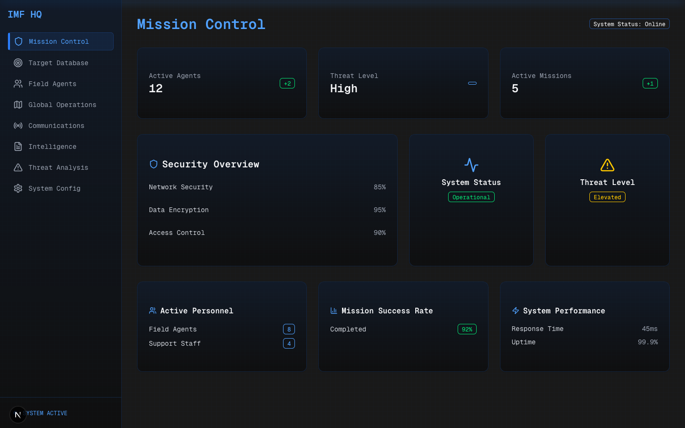

# Mission Control Dashboard



> **⚠️ Portfolio Project Notice**  
> This is a portfolio project showcasing UI/UX and development capabilities. All data displayed in the application is fictional and serves demonstration purposes only. The project demonstrates modern web development practices using Next.js, TypeScript, and various other technologies.

A sophisticated mission control dashboard built with Next.js 14, featuring a sleek, cyberpunk-inspired design. This application provides real-time monitoring and management capabilities for field operations, agent tracking, and security systems.

### 🎯 Purpose
- Demonstrate proficiency in modern web development
- Showcase UI/UX design capabilities
- Implement complex animations and interactions
- Display responsive design principles
- Practice TypeScript and React best practices

> **Note**: All agent profiles, missions, and security data are fictional examples created for demonstration purposes.

## 🚀 Features

- **Real-time Mission Monitoring**
  - Live agent status tracking
  - Mission progress visualization
  - Threat level assessment
  - Global operations map

- **Agent Management**
  - Detailed agent profiles
  - Equipment tracking
  - Mission history
  - Performance metrics

- **Security Systems**
  - Encryption status monitoring
  - Network security analysis
  - Access control management
  - Threat detection

- **Communications Hub**
  - Secure messaging system
  - Encrypted channels
  - Real-time status updates
  - Signal strength monitoring

- **Intelligence Database**
  - Document management
  - Classification system
  - Search and filtering
  - Access logging

## 🛠️ Tech Stack

- **Framework**: [Next.js 14](https://nextjs.org/) with App Router
- **Styling**: [Tailwind CSS](https://tailwindcss.com/) & [Shadcn UI](https://ui.shadcn.com/)
- **Animations**: [Framer Motion](https://www.framer.com/motion/)
- **Icons**: [Lucide Icons](https://lucide.dev/)
- **Fonts**: [Geist Font](https://vercel.com/font)
- **Development**:
  - TypeScript for type safety
  - ESLint for code quality
  - Prettier for code formatting

## 🚀 Getting Started

1. **Clone the repository**
   ```bash
   git clone https://github.com/friedrich-x/funny-cyber.git
   cd funny-cyber
   ```

2. **Install dependencies**
   ```bash
   npm install
   # or
   yarn install
   # or
   pnpm install
   ```

3. **Start the development server**
   ```bash
   npm run dev
   # or
   yarn dev
   # or
   pnpm dev
   ```

4. **Open [http://localhost:3000](http://localhost:3000)**

## 🎨 Design Features

- **Cyberpunk Aesthetic**
  - Neon accents
  - Grid overlays
  - Gradient effects
  - Scanning animations

- **Responsive Design**
  - Mobile-first approach
  - Adaptive layouts
  - Touch-friendly interfaces

- **Interactive Elements**
  - Smooth transitions
  - Loading animations
  - Hover effects
  - Real-time updates

## 📱 Screenshots

> Note: Screenshots show example data and fictional scenarios created for demonstration purposes.

### Dashboard


### Agent Profiles


### Communications


### Settings


## 🔒 Security Features

- End-to-end encryption
- Secure authentication
- Role-based access control
- Activity logging
- Session management

## 🤝 Contributing

Contributions are welcome! Please feel free to submit a Pull Request. For major changes, please open an issue first to discuss what you would like to change.

1. Fork the Project
2. Create your Feature Branch (`git checkout -b feature/AmazingFeature`)
3. Commit your Changes (`git commit -m 'Add some AmazingFeature'`)
4. Push to the Branch (`git push origin feature/AmazingFeature`)
5. Open a Pull Request

## 📄 License

This project is licensed under the MIT License - see the [LICENSE](LICENSE) file for details.

## 🙏 Acknowledgments

- [Next.js Team](https://nextjs.org/)
- [Shadcn UI](https://ui.shadcn.com/)
- [Vercel](https://vercel.com)
- [Tailwind CSS](https://tailwindcss.com/)
- [Framer Motion](https://www.framer.com/motion/)

## 📞 Contact & Portfolio

Elias Ratt - [@friedrich-x](https://github.com/friedrich-x)

🔗 **Portfolio Links:**
- GitHub: [https://github.com/friedrich-x](https://github.com/friedrich-x)
- Project Repository: [https://github.com/friedrich-x/funny-cyber](https://github.com/friedrich-x/funny-cyber)

> 💼 This project is part of my portfolio demonstrating my skills in:
> - Modern Web Development
> - UI/UX Design
> - TypeScript & React
> - Animation & Interaction Design
> - Responsive Design
> - Clean Code & Best Practices

---

<p align="center">Made with ❤️ and ☕ as a portfolio project</p>
